# Ergonomie des formulaires : guider l'utilisateur, simplifier le code

[Les attributs & pseudo-classes associées](#attributs)

[D'autres pseudo-classes utiles](#pseudoClass)

[Les pseudo-éléments](#pseudoElement)

[Les pseudo-éléments généralistes](#generalElement)

## __Les balises HTML__ :

|    < input type=  |   |  \> | |
|----|---               |---                   |---                 |
|    | Text / Search    | 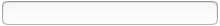   |                    |           
|    | Number           | 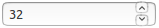  |*valide si :* (int) |           
|    | Range            | 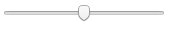   | *min=  max=*       | oninput= et < output>\* pour résultat    
|    | Radio            | 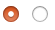   |                    |           
|    | Checkbox         | 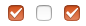    |                |           
|    | Date / Datetime / Datetime-local | 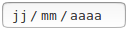  |  *IE & Firefox* :  pas supporté, sauf date pour Firefox...        |    
|    | Month / Week     | 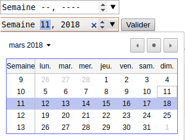    |   *IE & Firefox* : pas supportés...   |    
|    | Time             | 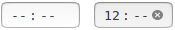    |   *IE* : pas supporté...      |    
|    | Email            |    |  *valide si :* a __@__ a    |    
|    | Password         | *caractères cachés*  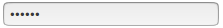    |    |    
|    | URL              |    |                    |           
|    | File             | 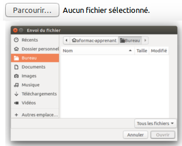    |                    |           
|    | Color            | 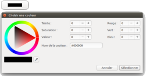   |                    |                   
|    | Hidden           | *- pour y cacher une valeur par défaut ?* |    |     
|    | Button           |   | *value=*           |          
|    | Reset            | 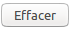| *réinitialise tous les champs du formulaire*    |    |
|    | Image *src= alt=* |  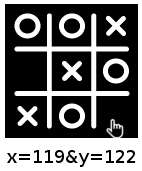 |  *il s'agit d'un __submit__ graphique : renvoie coordonnées du clic ( / image)*    |
|    | Submit|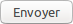 |            |                    |
|    __< input list=  >__  | < datalist >  *< option>  <òption>* </ datalist > | 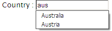 | *liste informative, qui se réduit selon entrées utilisateur*    |    |
| __< button>__  | *< img> blabla* | 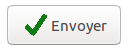  | __< /button>__ |   
| __< select>__ | < optgroup label="" > | 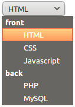 | < option> </ option> </ optgroup> | __ </ select>__
| __< select *multiple* >__ | *size = nb de lignes (multiple ou non)* | 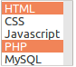 | < option> </ option> | __ </ select>__
| __< textarea>__ | *cols= rows=* |  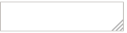 | __</ textarea>__ |
| __< progress>__ | *value= max=* | 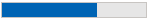  | __</ progress>__ | *barre remplie de façon dynamique grâce au rapport entre la value et le max*
| __< meter>__    |  *value=*    | 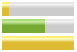  *IE* : pas supporté| __</ meter>__ | *jauge remplie de façon statique, par défaut min=0 et max=1 ; change de couleur si valeur au-delà de high= ou low=* |
| __*< fieldset>*__  | - *cadre, non interactif* - | 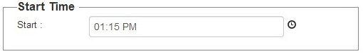 | < legend> </ legend> |__   *</ fieldset>* __
| __*< label*__ for= __*>*__ |- *information, non interactif* -| *__</ label>__*
| __*< output >*__ \* | - *résultat, non interactif* - | __*< output >*__ |    |

\* Exemples d'utilisation d'une balise __< output > :__

pour un calcul :
> < form __oninput = " result.value =__ parseInt __(nb1.value) /__ parseInt __(nb2.value) "__>

> < input id="nb1"> / < input id="nb2"> = __< output name=__ "result" __for=__ "nb1 nb2" __>__

pour afficher la valeur d'un range :
> < input type="range" __id="input"__  min="1" max="100" __oninput="output.value = input.value"__>

> __< output id="output"></output>__

## __<a id="attributs">Les attributs HTML et leurs pseudo-classes CSS associées</a>__
Une pseudo-classe CSS se réfère à un état particulier de l’élément, ou à un élément répondant à telle ou telle condition. Parmi les plus connues, il y a les états d’un lien : non visité, survolé, actif, visité, ou encore les nth-child.

La syntaxe est celle-ci :

> *selector__:pseudo-class__*   {

> 	 property: value;
> }

Un certain nombre de pseudo-classes sont spécifiques aux éléments de formulaire, d'autres, plus généraux, s'y appliquent particulièrement bien.

 Lorsqu'on stylise la pseudo-classe d'un élément, la mise en forme sur l'élément lui-même n'est pas appliquée (on repart d'une base vierge).

#### autofocus & tabindex=
- __autofocus__ : L'élément a le focus au chargement de la page. Attribut sans paramètre.
- __tabindex__ : Détermine l'ordre de focus : tabindex=1 tabindex=3 tabindex=2.

Par défaut, le focus *(tab)* suit l'ordre d'apparition des éléments dans le formulaire. Il est très important pour le confort utilisateur de bien penser son ordre de focus.

|-> *A utiliser avec la __pseudo-classe__ CSS* __:focus__

#### value="" & placeholder=""
- __value__ donne une valeur au champ, comme si l'utilisateur l'avait lui-même entrée, qui sera envoyée avec le formulaire.
- __placeholder__ donne une indication à l'utilisateur, sans toucher à la valeur ; il disparaît au premier caractère tapé. Le placeholder n'est jamais envoyé avec le formulaire.

#### checked
Pour les cases à cocher uniquement : case cochée au chargement de la page.
|-> *A utiliser avec la __pseudo-classe__ CSS* __:checked__

#### title=""
S'applique à tout élément HTML (sauf range ?) pour faire apparaître une bulle de texte guidant l'utilisateur. Bien utile sur les formulaires lorsque des contraintes ou possibilités spécifiques existent !

#### multiple
Fonctionne avec :
* <__select__>
* < input __type="file"__>
* < input __type="email"__>. Pour entrer plusieurs emails, les séparer d'une virgule.  Mettre un title pour en informer l'utilisateur !

#### pattern="" , min= , max= , step=
* __pattern__ : L'entrée utilisateur doit correspondre à l'expression régulière pour être valide.
> pattern="[0-9]{3}"  pour le code d'un département
* __min__, __max__ : *(type="number" ou type="range")* valeurs numériques minimales et maximales autorisées. Sans minimum, les nombres peuvent être négatifs.
* __step__ : *(type="number" ou type="range")* 'pas' ou écart entre deux valeurs numériques successives __(conditionne l'incrémentation)__.
>  min=1 step=2 rendra invalides les nombres pairs rentrés directement par l'utilisateur.

|-> *A utiliser avec les __pseudo-classes__ CSS* __:valid__ *&* __:invalid__ *, et/ou* __:in-range__ & __:out-of-range__ *qui ne considèrent que le min et max autorisés et non le step ou le pattern.*

 Un champ vide est valide par défaut.  Ne pas utiliser seul : les éléments non formulaire sont considérés aussi, avec des résultats variés.

#### maxlength=""
Bloque en écriture lorsque le nombre de caractères est atteint.

#### autocomplete=
Suggère une donnée entrée précédemment lorsque la/les première(s) lettres correspondent.
Deux valeurs possibles : __on__ ou __off__. Peut s'appliquer au formulaire dans son intégralité et/ou à un champ particulier.

#### required & optional
* __required__ : si l'utilisateur ne donne pas de valeur au champ, empêche l'envoi (message).
* __optional__ : par défaut ; vide, le champ n'empêche pas l'envoi.

|-> *A utiliser avec les __pseudo-classes__ CSS* __:required__ *&* __:optional__

#### disabled & readonly
* __disabled__ : empêche l'interaction utilisateur sur l'élément. Par défaut le bouton ou le champ est grisé. Aucune valeur ne sera envoyée. Tab ne lui donnera pas le focus.
* __readonly__ : empêche l'utilisateur de modifier la valeur de l'élément, mais elle sera bel et bien envoyée avec le formulaire. Tab lui donnera le focus. Grisé par défaut. Ne fonctionne pas avec < select > < button > < option >.

|-> *A utiliser avec les __pseudo-classes__ CSS* __:disabled__ *&* __:enabled__.

 La pseudo-classe __:read-only__ ou __:-moz-read-only__ ne concerne que quelques navigateurs. Sa contraire __:read-write__ est mieux supporté, mais pas par IE, et elle ne concerne que les input text (et textarea).

#### hidden
L'attribut __hidden__ glissé dans un tag équivaut au css __display: none;__  (voir ci-après).

### Les attributs du formulaire
#### target=""
Détermine où afficher la réponse serveur après soumission du formulaire. Comme pour les liens, peut prendre les valeurs :

* &nbsp;**_blank** (nouvel onglet ou page)
* __\_self__ (iframe/page actuelle, par défaut)
* __*iframe_name*__ (s'affiche dans l'iframe nommé)

## __<a id="pseudoClass">Les pseudo-classes généralistes</a>__ :

#### :hover
Au survol : outre un changement d'apparence, hover peut par exemple permettre de styliser une "infobulle" maison :

> p {

>      display: none;
}

> div__:hover__ p {

>      display: block;
}

###### *Note :* visibility: hidden; & display: none;
Ces propriétés CSS sont extrêmement utiles pour cacher une partie du formulaire qui ne concerne que certaines situations, et la faire réapparaître si l'utilisateur a entré des données qui la rendent pertinente (exemple : renseignements sur les enfants inutiles si on a zéro enfant).

* __visibility:hidden__ : on ne voit plus l'élément ni ses enfants, par contre la place est toujours prise. Pour le faire réapparaître on utilise __visibility:visible__.
* __display:none__ : l'élément est retiré avec ses enfants, le reste du code remonte de façon à prendre sa place. L'élément n'est cependant pas détruit et on peut le rétablir à tout moment grâce à un display approprié : __display:flex|inline|block|....__

#### :active
Au clic : comme hover, peut (fugacement) modifier ou faire apparaître quelque chose (l'image du bouton cliqué). Moins durable...

#### :lang()
Si on a renseigné dans des tags l'__attribut lang=""__ (fr, en, fr-FR, en-US, ru, en...), on peut cibler ces éléments en css grâce à la pseudo-class __:lang()__

> < html __lang="fr"__> < blockquote __lang="en"__> *A person who never made a mistake never made anything new.* < /blockquote>

> < style> __:lang(en)__  {  font-style: italic;   } < /style>

*Note* : :lang(fr) trouve les lang="fr" et les lang="fr-FR").

### Cibler certains éléments selon leur ordre, type, enfants...
#### :first-child, :nth-child(), :last-child
Cible le premier, le nième, le dernier enfant de l'élément, mais aussi :
* les enfants pairs __:nth-child(even)__
* les enfants impairs __:nth-child(odd)__
* tous les trois enfants en commençant par le premier __:nth-child(3n+1)__ - ou autre

#### :first-of-type, :nth-of-type(), :last-of-type, :nth-last-of-type(), only-of-type
De la même manière que les -child, cible le premier, le nième, le dernier élément du type indiqué, pour chaque niveau :
* par exemples les lignes paires de chaque tableau : tr:__nth-of-type(even)__
* __:nth-last-of-type(2)__ : l'avant-dernier du type (par exemple avec des li, si le dernier est simplement informatif)
* input[type="option"]__:only-of-type__ : seulement s'il est le seul élément de ce type à un niveau donné

#### :not()
Sélectionne tout ce qui n'est pas...  il faut avoir stylisé les propriétés de l'élément pour que les mêmes propriétés ne s'appliquent qu'aux non-éléments.

    input:[type="text"]
      {
        ma_propriété: valeur;
      }

    input:not( [type="text"] )
      {
        ma_propriété: autre_valeur;
      }

#### :empty
 Ne désigne pas un champ sans valeur mais un __élément sans innerHTML__, en dur dans le code :

* Un paragraphe pour être *empty* ne doit contenir ni balises ni texte.
* Un textarea vide dans le code reste *empty* quand l'utilisateur le remplit.
* Un élément sans balise fermante ne peut être qu'*empty*.

#### :link
Lien.

#### :root
Sélectionne la racine du document, c'est-à-dire la balise html. C'est une équivalence stricte. Dans d'autres langages, ça peut être différent.

Utilité : définir la taille de base, en pixels, des polices de caractères, permettant de calibrer son "em".
> :root { font-size: 10px; }

> div { width: 60em; }

## __<a id="pseudoElement">Les pseudo-éléments</a>__
Contrairement aux pseudo-classes, les pseudo-éléments en HTML5 sont annoncés par __deux ::__. Ce sont des éléments sans balise, soit qui s'ajoutent (::before & ::after), soit qui délimitent une partie du contenu d'une balise.

Il n'y a que cinq pseudo-éléments généralistes ; __les pseudo-éléments de formulaire ne sont pas standards__ et dépendent donc des navigateurs.

Les éléments de formulaire ont tous une apparence différente selon le navigateur, et leurs pseudo-classes sont appelées différemment. Les préfixes à utiliser sont __-moz-__ pour Firefox, __-webkit-__ pour Safari et Chrome, __-o-__ pour Opera et __-ms-__ pour Internet Explorer. Parfois, l'appellation sans préfixe sera utilisée par tel ou tel navigateur. Mieux vaut vérifier avant de se lancer.

Jouer avec ces pseudo-éléments de formulaire permet d'homogénéiser autant que personnaliser ces apparences par défaut. Pour __enlever toutes les valeurs de l'apparence par défaut__ :
> form \* {

>  &nbsp; &nbsp; __-webkit-appearance: none;__ // Chrome,

>  &nbsp; &nbsp;  __-moz-appearance:    none;__

>  &nbsp; &nbsp;  __appearance:         none;__

> }

Pour aller plus loin : [reset CSS](https://gist.github.com/anthonyshort/552543)
#### input::-moz-focus-inner, input::-moz-focus-outer
Sous Firefox, l'élément qui a le focus est entouré d'une bordure en pointillé que l'on peut retirer ( border: none; ).

#### Exemple des pseudo-éléments pour input range :
> ::-webkit-slider-runnable-track / ::-moz-range-track / ::-ms-track

> ::-webkit-slider-thumb / ::-moz-range-thumb / ::-ms-thumb

Le track est la barre, le thumb le curseur. Si l'on veut styliser les deux éléments, il faut également penser à les styliser en :hover :focus et :active. Voici comment les pseudo-classes et éléments peuvent s'enchaîner :

> input[type=range]__:hover::-webkit-slider-thumb:before__

  Consulter la documentation des navigateurs pour connaître tous les pseudo-éléments d'un type d'élément de formulaire donné.

### __<a id="generalElement">Pseudo-éléments généralistes</a>__ :

#### ::selection
Ce qui est sélectionné par l'utilisateur.

#### ::before & ::after
La seule propriété indispensable de ces pseudo-éléments, c'est __content=__;, que l'on peut remplir avec :
> une chaîne de caractère (avec guillemets) : __content: "";__  ou __content: "Note: ";__

> une image (sans guillemets) : __content: url(__icon.png__);__

> un compteur de liste (sans guillemets) :  __content: counter(__var__)__;

Si l'on veut mettre plusieurs éléments (compteur et texte par ex), on les sépare juste d'un espace :

> ul {

> &nbsp; &nbsp; &nbsp; &nbsp; __counter-reset__: chap; &nbsp; &nbsp; &nbsp; &nbsp; &nbsp; &nbsp; &nbsp; &nbsp; &nbsp; &nbsp; &nbsp; &nbsp; &nbsp; &nbsp; &nbsp; &nbsp; &nbsp; &nbsp; &nbsp; &nbsp; &nbsp; &nbsp; &nbsp; &nbsp; &nbsp; &nbsp; &nbsp; &nbsp;  // *initialise le compteur : on le place au niveau du parent des entrées de la liste, et on lui donne un nom (ici chap)*

> }

> li::before {

> &nbsp; &nbsp; &nbsp; &nbsp; counter-increment: chap;  &nbsp; &nbsp; &nbsp; &nbsp; &nbsp; &nbsp; &nbsp; &nbsp; &nbsp; &nbsp; &nbsp; &nbsp; &nbsp; &nbsp; &nbsp; &nbsp; &nbsp; &nbsp; &nbsp; &nbsp; &nbsp; &nbsp; &nbsp; &nbsp; *// incrémente le compteur*

> &nbsp; &nbsp; &nbsp; &nbsp; content: __url(__puce.png__) "__ chapitre __" counter(__chap__)__; &nbsp; &nbsp; &nbsp; // *donne : * __\* chapitre 1__

> }

Ces pseudo-éléments sont __par défaut en display: inline;__. Pour les dimensionner et les positionner autrement, il faudra changer pour du __display: inline-block; ou du display: block;.__

#### ::first-letter & ::first-line
Comme pour le ::before ou ::after, si l'on souhaite changer les dimensions ou la position de la première lettre/ligne, il faudra changer son display (par défaut inline).
